# Rails Branch Implementation

This document describes the transformation of GiftHealth from a CLI tool into a full Rails 8 web application with database persistence, web interface, REST API, and automated CI/CD.

## Table of Contents

1. [Overview](#overview)
2. [Technical Stack](#technical-stack)
3. [Database & Models](#database--models)
4. [Features](#features)
5. [Testing & Quality](#testing--quality)
6. [CI/CD & Security](#cicd--security)
7. [Deployment](#deployment)
8. [Future Roadmap](#future-roadmap)

---

## Overview

### Transformation

| Aspect | Before (Main Branch) | After (Rails Branch) |
|--------|---------------------|----------------------|
| **Architecture** | CLI tool with POROs | Full Rails 8 web application |
| **Data Storage** | In-memory | SQLite/PostgreSQL database |
| **Interface** | Command-line only | Web UI + REST API + CLI |
| **File Support** | Text files | CSV, Excel, TXT |
| **Operations** | Read-only processing | Full CRUD capabilities |
| **Testing** | 48 RSpec tests | 62 RSpec tests + CI/CD |
| **Security** | N/A | Automated scanning + HIPAA checks |

### Quick Start

```bash
# Setup
bundle install
bundle exec rake db:create db:migrate

# Run web server
bundle exec rails server
# Visit http://localhost:3000

# Run tests
bundle exec rspec

# Run CLI (still works!)
./bin/prescription_processor spec/fixtures/sample_input.txt
```

---

## Technical Stack

### Core Dependencies

```ruby
# Framework
gem 'rails', '~> 8.0'
gem 'sqlite3', '~> 2.0'           # Dev/test database
gem 'puma', '~> 6.4'              # Web server

# Frontend
gem 'sprockets-rails', '~> 3.5'   # Asset pipeline
gem 'importmap-rails', '~> 2.0'   # JavaScript modules
gem 'turbo-rails', '~> 2.0'       # SPA-like interactions
gem 'stimulus-rails', '~> 1.3'    # JavaScript framework

# File Processing
gem 'roo', '~> 2.10'              # Excel parsing
gem 'roo-xls', '~> 1.2'           # Legacy Excel

# Documentation
gem 'redcarpet', '~> 3.6'         # Markdown rendering
gem 'rouge', '~> 4.6'             # Syntax highlighting

# Testing
gem 'rspec-rails', '~> 6.1'
gem 'database_cleaner-active_record', '~> 2.1'
gem 'factory_bot_rails'
gem 'faker'
```

### Architecture

```
app/
├── controllers/
│   ├── prescriptions_controller.rb    # Main CRUD
│   ├── patients_controller.rb         # Patient management
│   ├── documents_controller.rb        # Documentation viewer
│   └── api/v1/
│       └── prescription_events_controller.rb  # JSON API
├── models/
│   ├── patient.rb                     # ActiveRecord
│   └── prescription.rb                # ActiveRecord
├── services/
│   ├── prescription_event_processor.rb # Business logic
│   └── file_parser_service.rb         # File upload handling
├── views/
│   ├── prescriptions/
│   │   ├── index.html.erb            # Main dashboard
│   │   ├── new.html.erb              # Create form
│   │   └── edit.html.erb             # Edit form
│   ├── patients/
│   │   └── index.html.erb            # Patient list
│   └── documents/
│       ├── show.html.erb             # Markdown viewer
│       └── erd.html.erb              # ERD viewer with zoom/pan
└── assets/
    └── stylesheets/
        └── application.css           # Pharmacy-themed design
```

---

## Database & Models

### Entity Relationship Diagram



*Interactive viewer available at `/documents/erd` with zoom/pan controls*

### Schema

**Patients:**
```ruby
create_table :patients do |t|
  t.string :name, null: false, index: { unique: true }
  t.timestamps
end
```

**Prescriptions:**
```ruby
create_table :prescriptions do |t|
  t.references :patient, null: false, foreign_key: true
  t.string :drug_name, null: false
  t.boolean :created, default: false, null: false
  t.integer :fill_count, default: 0, null: false
  t.integer :return_count, default: 0, null: false
  t.timestamps
  
  t.index [:patient_id, :drug_name], unique: true  # One prescription per patient-drug
end
```

**Key Design Decisions:**
- Unique constraint prevents duplicate patient names
- Compound index ensures one prescription per patient-drug combination
- Counters (`fill_count`, `return_count`) stored for performance
- Foreign key maintains referential integrity
- Timestamps enable audit trails

### Models

**Patient (ActiveRecord):**
```ruby
class Patient < ApplicationRecord
  has_many :prescriptions, dependent: :destroy
  validates :name, presence: true, uniqueness: true
  
  # Business logic methods
  def total_fills
    prescriptions.sum(&:net_fills)
  end
  
  def total_income
    prescriptions.sum(&:income)
  end
end
```

**Prescription (ActiveRecord):**
```ruby
class Prescription < ApplicationRecord
  belongs_to :patient
  validates :drug_name, presence: true, uniqueness: { scope: :patient_id }
  
  # Business rules preserved from original
  def fill
    return nil unless created?
    increment!(:fill_count)
    self
  end
  
  def income
    (net_fills * 5) - return_count
  end
  
  def net_fills
    fill_count - return_count
  end
end
```

**Business Logic Preservation:**
- ✅ Prescriptions must be created before filling
- ✅ Cannot return more than filled
- ✅ Income = `(net_fills × $5) - (returns × $1)`
- ✅ All original business rules maintained

---

## Features

### 1. Web Interface

**Dashboard** (`/`)
- Upload files (CSV, Excel, TXT)
- Manual event entry
- Real-time income report
- Summary statistics
- Pharmacy-themed design (teal color scheme)

**File Upload:**
- Drag-and-drop support
- Multiple formats: CSV, XLS, XLSX, TXT (space-delimited)
- Instant processing and validation
- Error reporting with line numbers

### 2. CRUD Operations

**Prescriptions** (`/prescriptions`)
- **Create**: Add new prescriptions manually
- **Read**: View all prescriptions with statistics
- **Update**: Edit fill counts, drug names, status
- **Delete**: Remove prescriptions (auto-cleans patients)
- **Quick Actions**: 
  - Increment fill (+ button)
  - Decrement fill/return (- button)

**Patients** (`/patients`)
- View all patients with aggregated statistics
- Delete patient and all prescriptions
- Clear all prescriptions for a patient

### 3. REST API

**Base URL:** `/api/v1`

**Create Single Event:**
```bash
POST /api/v1/prescription_events
Content-Type: application/json

{
  "patient_name": "John",
  "drug_name": "A",
  "event_name": "created"
}

# Response: 201 Created
{
  "message": "Event processed successfully",
  "patient_name": "John",
  "drug_name": "A",
  "event_name": "created"
}
```

**Batch Create:**
```bash
POST /api/v1/prescription_events/batch
Content-Type: application/json

{
  "events": [
    {"patient_name": "John", "drug_name": "A", "event_name": "created"},
    {"patient_name": "John", "drug_name": "A", "event_name": "filled"}
  ]
}

# Response: 200 OK
{
  "processed": 2,
  "total": 2
}
```

**⚠️ Authentication:** Currently none - **not production-ready**. See [HIPAA_COMPLIANCE.md](../HIPAA_COMPLIANCE.md) for requirements.

### 4. Documentation Viewer

**Markdown Rendering** (`/documents/:name`)
- Renders all `.md` files with syntax highlighting
- Table of contents with anchor links
- Code blocks with proper indentation
- Dark theme for code
- Example: `/documents/REQUIREMENTS`

**ERD Viewer** (`/documents/erd`)
- Interactive SVG diagram
- Zoom in/out controls
- Pan with click-drag
- Fit-to-screen button
- Mouse wheel zoom support

### 5. Database Management

**Reset Database** (Button on main page)
- Clears all patients and prescriptions
- JavaScript confirmation dialog
- Useful for testing/demos

### 6. CLI Compatibility

Original command-line interface still works:
```bash
# Process file
./bin/prescription_processor spec/fixtures/sample_input.txt

# Process stdin
cat data.txt | ./bin/prescription_processor

# Now uses database instead of in-memory storage
```

---

## Testing & Quality

### Test Coverage

**62 RSpec Tests:**
- 18 Prescription model tests
- 10 Patient model tests  
- 13 PrescriptionEventProcessor tests
- 14 CRUD operation tests
- 3 CLI tests
- 2 Integration tests
- 2 Performance tests

**All tests passing** ✅

### Database Cleaner Strategy

```ruby
# Fast transactions for unit tests
config.before(:each) do |example|
  strategy = example.metadata[:type] == :integration ? :truncation : :transaction
  DatabaseCleaner.strategy = strategy
end
```

### Code Quality

**RuboCop Configuration:**
```yaml
Metrics/AbcSize: {Max: 36}
Metrics/MethodLength: {Max: 40}
Metrics/ClassLength: {Max: 150}
Metrics/CyclomaticComplexity: {Max: 10}
```

**Current Status:** 0 offenses ✅

---

## CI/CD & Security

### GitHub Actions Workflows

#### 1. CI Workflow
**Runs:** Every push/PR to `main` or `rails`

**Jobs:**
- Run full RSpec test suite (62 tests)
- Run RuboCop linter
- PostgreSQL compatibility testing

**Status:** 

#### 2. Security Workflow
**Runs:** Every push/PR + **Weekly (Mon 8AM UTC)**

**Scans:**
- **bundler-audit**: CVE vulnerability detection
- **Brakeman**: Rails security scanner (SQL injection, XSS, etc.)
- **Dependency Review**: PR dependency analysis

**Status:** 

#### 3. CodeQL Workflow
**Runs:** Every push/PR + **Weekly (Wed 2AM UTC)**

**Analysis:**
- Ruby semantic code analysis
- JavaScript security scanning
- Results in GitHub Security tab

**Status:** 

#### 4. HIPAA Compliance Workflow
**Runs:** Every push/PR + **Daily (3AM UTC)**

**Checks:**
- **PHI Detection:**
  - detect-secrets (hardcoded credentials)
  - Custom regex (SSN, MRN, credit cards)
  - Nightfall AI (optional, ML-based)
  
- **Security Controls:**
  - SSL/TLS enforcement
  - Encryption configuration
  - Session security
  - Database security
  
- **Access Control:**
  - Authentication detection
  - Authorization framework
  - API security verification
  
- **Compliance:**
  - OWASP dependency check
  - Audit logging verification
  - Data retention policies
  - Generates compliance report

**Status:** 

**⚠️ Current Compliance Status: NOT HIPAA COMPLIANT**
- No user authentication
- No API authentication  
- No encryption at rest
- No audit logging
- **For development/testing only**

See [HIPAA_COMPLIANCE.md](../HIPAA_COMPLIANCE.md) for complete requirements.

### Security Tools Integrated

| Tool | Purpose | Cost | Setup |
|------|---------|------|-------|
| **detect-secrets** | Secrets detection | Free | Included |
| **OWASP Dependency-Check** | CVE scanning | Free | Included |
| **Brakeman** | Rails security | Free | Included |
| **CodeQL** | Semantic analysis | Free | Included |
| **Nightfall AI** | ML-based PHI detection | Free tier | Optional: Add API key to secrets |

### Local Development Workflow

```bash
# Before committing
bundle exec rspec                      # Run tests
bundle exec rubocop                    # Check style
bundle exec rubocop -a                 # Auto-fix
bundle audit                           # Check vulnerabilities
brakeman                               # Security scan

# Optional PHI checks
grep -r -E '\b[0-9]{3}-[0-9]{2}-[0-9]{4}\b' app/ spec/  # SSN
grep -r -E '\bMRN[:\s]*[0-9]{6,}\b' app/ spec/         # MRN

# Commit
git add .
git commit -m "Description"
git push origin feature-branch
```

### Pull Request Checklist

- [ ] All CI tests pass (62/62)
- [ ] RuboCop clean (0 offenses)
- [ ] No security vulnerabilities
- [ ] No PHI detected in code
- [ ] CodeQL analysis complete
- [ ] HIPAA checks pass (or exceptions documented)
- [ ] Code reviewed
- [ ] Documentation updated

---

## Deployment

### Development

```bash
bundle exec rails server
# Visit http://localhost:3000
```

### Production Checklist

**Infrastructure:**
- [ ] Switch from SQLite to Amazon RDS PostgreSQL
- [ ] Enable SSL/TLS (AWS Certificate Manager)
- [ ] Configure environment variables (AWS Secrets Manager)
- [ ] Set up automated RDS backups (encrypted)
- [ ] Configure Security Groups (firewall)
- [ ] Enable AWS Shield (DDoS protection)
- [ ] Set up VPC with private subnets
- [ ] Configure Application Load Balancer

**Application:**
- [ ] Implement authentication (Devise)
- [ ] Implement authorization (Pundit)
- [ ] Add API authentication (JWT/OAuth)
- [ ] Enable audit logging (PaperTrail)
- [ ] Configure session timeout (15 min)
- [ ] Add rate limiting (Rack::Attack)
- [ ] Set up error tracking (Sentry/AWS X-Ray)

**Monitoring & Logging:**
- [ ] CloudWatch Logs for application logs
- [ ] CloudWatch Metrics for performance monitoring
- [ ] CloudWatch Alarms for critical events:
  - High CPU/memory usage (>80%)
  - Error rate threshold (>5%)
  - Response time degradation (>2s)
  - Database connection errors
  - Failed authentication attempts (>100/min)
- [ ] CloudWatch Dashboards for visualization
- [ ] SNS alerts for on-call notifications
- [ ] AWS X-Ray for distributed tracing
- [ ] VPC Flow Logs for network monitoring

**HIPAA Compliance (if handling real PHI):**
- [ ] Encrypt data at rest
- [ ] Encrypt data in transit (SSL)
- [ ] Sign BAAs with all vendors
- [ ] Complete risk assessment
- [ ] Document incident response plan
- [ ] Implement audit logging
- [ ] User security training
- [ ] Data retention policies

**See [HIPAA_COMPLIANCE.md](../HIPAA_COMPLIANCE.md) for complete guide**

### Example: AWS Fargate Deployment

**Dockerfile:**
```dockerfile
FROM ruby:3.3-slim

RUN apt-get update -qq && apt-get install -y \
  build-essential libpq-dev nodejs postgresql-client

WORKDIR /app
COPY Gemfile Gemfile.lock ./
RUN bundle install

COPY . .

EXPOSE 3000
CMD ["bundle", "exec", "puma", "-C", "config/puma.rb"]
```

**Deploy to AWS Fargate:**
```bash
# Build and push to ECR
aws ecr get-login-password --region us-east-1 | \
  docker login --username AWS --password-stdin <account-id>.dkr.ecr.us-east-1.amazonaws.com

docker build -t gifthealth .
docker tag gifthealth:latest <account-id>.dkr.ecr.us-east-1.amazonaws.com/gifthealth:latest
docker push <account-id>.dkr.ecr.us-east-1.amazonaws.com/gifthealth:latest

# Update ECS service
aws ecs update-service --cluster gifthealth-cluster \
  --service gifthealth-service --force-new-deployment

# Run migrations
aws ecs run-task --cluster gifthealth-cluster \
  --task-definition gifthealth-migrate \
  --launch-type FARGATE \
  --network-configuration "awsvpcConfiguration={subnets=[subnet-xxx],securityGroups=[sg-xxx]}"
```

**Infrastructure (Terraform example):**
```hcl
resource "aws_ecs_cluster" "main" {
  name = "gifthealth-cluster"
}

resource "aws_ecs_service" "app" {
  name            = "gifthealth-service"
  cluster         = aws_ecs_cluster.main.id
  task_definition = aws_ecs_task_definition.app.arn
  desired_count   = 2
  launch_type     = "FARGATE"
  
  load_balancer {
    target_group_arn = aws_lb_target_group.app.arn
    container_name   = "gifthealth"
    container_port   = 3000
  }
}
```

### Performance Considerations

| Metric | In-Memory (Main) | Database (Rails) |
|--------|-----------------|------------------|
| 1000 events | ~0.1 seconds | ~9 seconds |
| Throughput | 200,000+ eps | 100-250 eps |
| Persistence | ❌ | ✅ |
| Concurrency | Single-threaded | Multi-threaded ready |

**Trade-offs:**
- ✅ Data persists across restarts
- ✅ ACID compliance
- ✅ Query capabilities
- ⚠️ ~90x slower (expected with database I/O)
- ⚠️ SQLite has write concurrency limits

**Optimization Options:**
1. Batch inserts (`insert_all`)
2. PostgreSQL (better concurrency)
3. Redis caching
4. Background jobs (Sidekiq)
5. Connection pooling

---

## Future Roadmap

### High Priority

**Authentication & Authorization:**
- User accounts (Devise)
- Role-based access (Pundit)
- API keys/OAuth
- MFA for admins

**Audit & Compliance:**
- Audit trail (PaperTrail)
- HIPAA compliance features
- Encrypted data at rest
- Session management

### Medium Priority

**Advanced Reporting:**
- Date range filtering
- Drug-specific reports
- PDF/Excel export
- Charts and visualizations

**Performance:**
- Background jobs (Sidekiq on Fargate)
- Amazon RDS PostgreSQL with read replicas
- Amazon ElastiCache for Redis
- CloudFront CDN for static assets
- Auto-scaling based on CloudWatch metrics

### Low Priority

**Feature Enhancements:**
- Email/SMS notifications
- Drug catalog management
- Patient profiles
- Multi-pharmacy support (multi-tenancy)
- Inventory tracking

### Technical Debt

- API versioning strategy
- Pagination for large datasets
- Structured logging (JSON format for CloudWatch Insights)
- CloudWatch Container Insights integration
- Code coverage reporting (SimpleCov with CodeCov)
- AWS Cost Explorer integration for budget alerts

---

## Resources

- **[HIPAA Compliance Guide](../HIPAA_COMPLIANCE.md)** - Complete compliance requirements and implementation guide
- **[API Documentation](API_DOCUMENTATION.md)** - REST API reference
- **[SOLID Principles](SOLID_PRINCIPLES.md)** - Design principles used
- **[Technology Choices](TECHNOLOGY_CHOICES.md)** - Architecture decisions
- **[Requirements](REQUIREMENTS.md)** - Original business requirements
- **[Rails Guides](https://guides.rubyonrails.org/)** - Official Rails documentation

---

## Summary

This Rails implementation provides:

- ✅ Full-stack web application (Rails 8)
- ✅ Database persistence (SQLite/PostgreSQL)
- ✅ Beautiful pharmacy-themed web UI
- ✅ Complete CRUD operations
- ✅ REST API for integrations
- ✅ Multi-format file uploads (CSV, Excel, TXT)
- ✅ Backward-compatible CLI
- ✅ Comprehensive test coverage (62 tests)
- ✅ Automated CI/CD pipeline
- ✅ Security scanning (4 workflows)
- ✅ HIPAA compliance checks
- ✅ Interactive documentation viewer
- ✅ Code quality enforcement (RuboCop)

**Status:** Production-ready architecture, **NOT yet HIPAA compliant** for real PHI. Authentication and encryption required before handling sensitive data.
